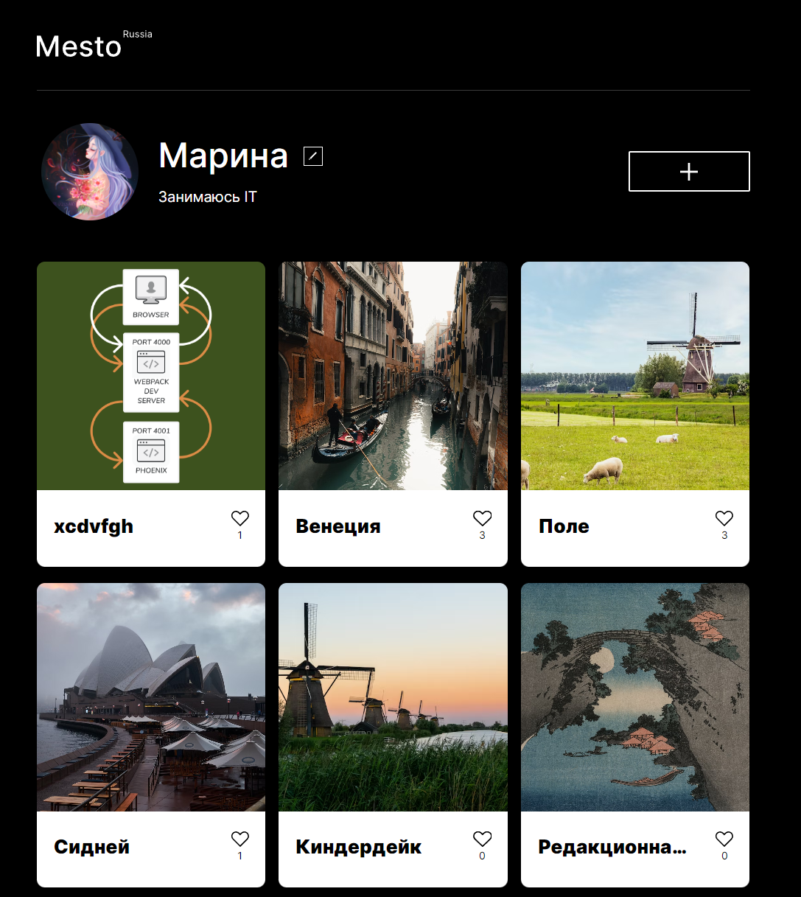

# Проект: Mesto



## Стек:


методологии BEM

##Запуск проекта

Клонируйте репозиторий

```
git clone https://github.com/M0riaz/mesto-project.git
```

В терминале введите

```
npm install
```

После установки зависимостей введите

```
npm run dev
```


Сайт можно посмотреть по данной ссылке: https://m0riaz.github.io/mesto-project/ 